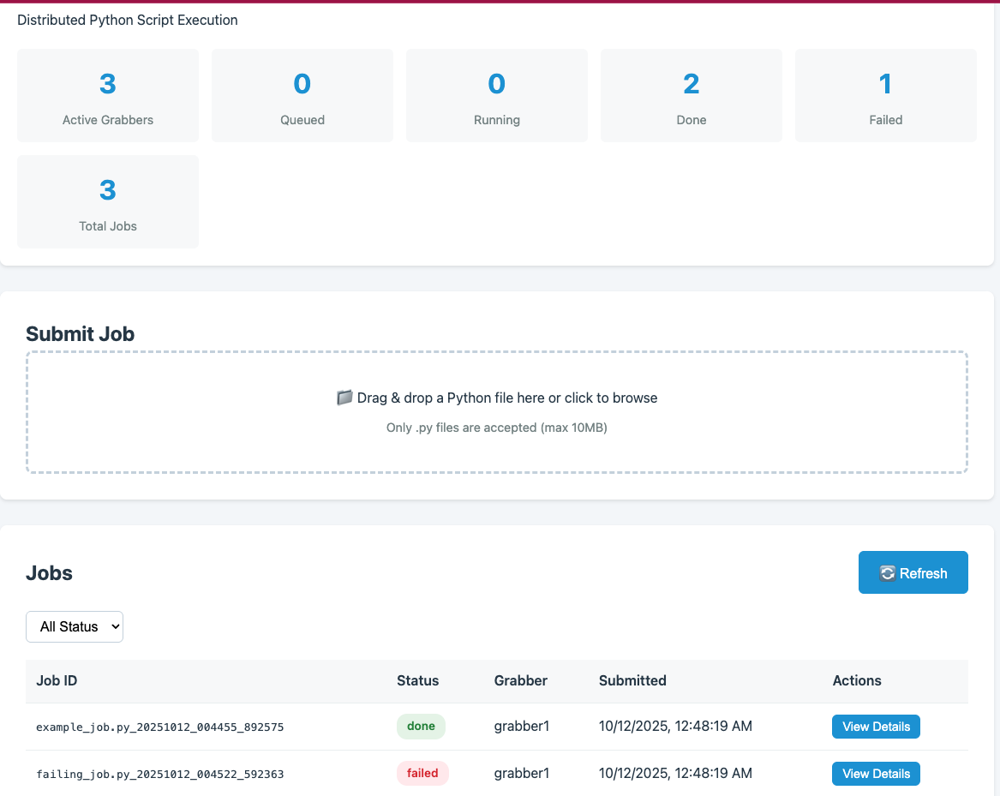

# ScriptGrabber
ScriptGrabber is a Python script that implements a simple polling mechanism to grab python scripts from a source system and execute it. The script is designed to be run as a standalone process and can be controlled using Unix signals.



## Getting started

### Prerequisites
Install uv (modern Python package manager):

```bash
# macOS and Linux
curl -LsSf https://astral.sh/uv/install.sh | sh

# Windows
powershell -c "irm https://astral.sh/uv/install.ps1 | iex"

# Or via pip
pip install uv
```

### Installation

1. Clone the repository:

```bash
git clone https://github.com/meirm/script_grabber.git
cd script_grabber
```

2. Build and install using uv:

```bash
# Build the project
uv build

# Install in development mode
uv pip install -e .

# Or install from PyPI
uv pip install script-grabber
```

You might need to change the clusterpath variable to point to the location of your data cluster, or change the poll_interval variable to control how often the script should poll for data.

3. Run the script:

```bash
# Using the CLI entry point
grabber <name> <cluster_path> [--job-timeout SECONDS]

# Or run as a module
uv run python -m script_grabber.grabber <name> <cluster_path>
```
The script will start polling for data and writing it to a file in the data directory.
## Usage
ScriptGrabber uses a simple polling mechanism to grab data from a source system. The main logic of the script is contained in the run method, which is called by the __init__ method when an instance of the ScriptGrabber class is created.

By default, the script polls for data every second and writes it to a file in the data directory. You can customize the polling interval by changing the poll_interval variable in the __init__ method.

ScriptGrabber also supports several Unix signals that can be used to control its behavior. Here are the supported signals:


SIGTERM: stops the script, renames the jobs to "interrupted", and exits

SIGUSR1: dumps the current status of the script

SIGUSR2: pauses or resumes the polling loop

To send a signal to a running instance of ScriptGrabber, use the kill command with the PID of the Python process that's running the script. For example, to send a SIGTERM signal to a ScriptGrabber instance with PID 1234, run:

```bash
kill -SIGTERM 1234
```

## Testing

ScriptGrabber includes a comprehensive test suite covering unit tests, integration tests, and end-to-end tests.

### Installing Test Dependencies

```bash
# Install package with development dependencies
uv pip install -e ".[dev]"
```

### Running Tests

```bash
# Run all tests with verbose output
uv run pytest -v

# Run only unit tests (fast, isolated)
uv run pytest -m unit -v

# Run only integration tests
uv run pytest -m integration -v

# Run only end-to-end tests
uv run pytest -m e2e -v

# Run tests with coverage report
uv run pytest --cov=src/script_grabber --cov-report=term-missing

# Generate HTML coverage report
uv run pytest --cov=src/script_grabber --cov-report=html
# Open htmlcov/index.html in a browser

# Run specific test file
uv run pytest tests/unit/test_grabber.py -v

# Run tests matching a pattern
uv run pytest -k "signal" -v
```

### Test Organization

- **Unit tests** (`tests/unit/`): Fast, isolated tests with no file system dependencies
- **Integration tests** (`tests/integration/`): Tests with real file system operations
- **End-to-end tests** (`tests/e2e/`): Full system tests with multiple processes

### Test Markers

Tests are marked with pytest markers for selective execution:
- `@pytest.mark.unit`: Unit tests
- `@pytest.mark.integration`: Integration tests
- `@pytest.mark.e2e`: End-to-end tests
- `@pytest.mark.slow`: Long-running tests

### Running Tests During Development

```bash
# Quick feedback: run only unit tests
uv run pytest -m unit

# Before committing: run all tests
uv run pytest

# Check coverage: ensure ≥80% coverage
uv run pytest --cov=src/script_grabber --cov-report=term-missing
```

## License
ScriptGrabber is released under the MIT License. See LICENSE for details.


