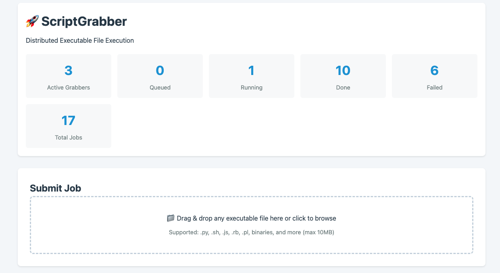

# ScriptGrabber

ScriptGrabber is a distributed job scheduling system that implements a file-based polling mechanism to execute any type of executable file. The system supports Python scripts, Bash/Shell scripts, Node.js, and any other executable file type with proper shebang configuration.



## Features

- **Multi-Language Support**: Execute Python, Bash, Shell, Node.js, Ruby, Perl, PHP, and other executable files
- **Intelligent Execution Detection**: Automatic detection via shebang lines or file extensions
- **Distributed Architecture**: Multiple grabber instances work in parallel
- **File-Based Coordination**: No database required - uses shared filesystem for job management
- **Web Interface**: Submit jobs and monitor status through REST API
- **Signal Control**: Pause/resume/status operations via Unix signals
- **Comprehensive Testing**: 80%+ test coverage with unit, integration, and e2e tests

## Quick Start

```bash
# 1. Install ScriptGrabber
pip install script-grabber

# 2. Create a bash script
cat > hello.sh << 'EOF'
#!/bin/bash
echo "Hello from ScriptGrabber!"
date
EOF

# 3. Start a grabber in one terminal
mkdir -p /tmp/cluster
grabber worker1 /tmp/cluster

# 4. Submit the job in another terminal
cp hello.sh /tmp/cluster/queue/

# 5. Check results
ls /tmp/cluster/spool/worker1/  # See job status
cat /tmp/cluster/log/hello.sh.out  # View output
```

Or use the web interface:

```bash
# Start the full stack with Docker
./scripts/create-pod.sh

# Open browser
open http://localhost:3000

# Submit jobs through the web UI
```

## Getting started

### Prerequisites
Install uv (modern Python package manager):

```bash
# macOS and Linux
curl -LsSf https://astral.sh/uv/install.sh | sh

# Windows
powershell -c "irm https://astral.sh/uv/install.ps1 | iex"

# Or via pip
pip install uv
```

### Installation

1. Clone the repository:

```bash
git clone https://github.com/meirm/script_grabber.git
cd script_grabber
```

2. Build and install using uv:

```bash
# Build the project
uv build

# Install in development mode
uv pip install -e .

# Or install from PyPI
uv pip install script-grabber
```

You might need to change the clusterpath variable to point to the location of your data cluster, or change the poll_interval variable to control how often the script should poll for data.

3. Run the script:

```bash
# Using the CLI entry point
grabber <name> <cluster_path> [--job-timeout SECONDS]

# Or run as a module
uv run python -m script_grabber.grabber <name> <cluster_path>
```
The script will start polling for data and writing it to a file in the data directory.
## Usage
ScriptGrabber uses a simple polling mechanism to grab data from a source system. The main logic of the script is contained in the run method, which is called by the __init__ method when an instance of the ScriptGrabber class is created.

By default, the script polls for data every second and writes it to a file in the data directory. You can customize the polling interval by changing the poll_interval variable in the __init__ method.

ScriptGrabber also supports several Unix signals that can be used to control its behavior. Here are the supported signals:


SIGTERM: stops the script, renames the jobs to "interrupted", and exits

SIGUSR1: dumps the current status of the script

SIGUSR2: pauses or resumes the polling loop

To send a signal to a running instance of ScriptGrabber, use the kill command with the PID of the Python process that's running the script. For example, to send a SIGTERM signal to a ScriptGrabber instance with PID 1234, run:

```bash
kill -SIGTERM 1234
```

## Supported File Types

ScriptGrabber supports executing any type of executable file through intelligent execution detection:

### Execution Detection Priority

1. **Shebang Line** (Highest Priority)
   - Reads the first line of the file for `#!` interpreter specification
   - Supports both direct paths: `#!/bin/bash`
   - And env-based paths: `#!/usr/bin/env python3`

2. **File Extension**
   - Falls back to extension-based detection if no shebang found
   - Supported extensions and interpreters:
     - `.py` → python3
     - `.sh`, `.bash` → /bin/bash
     - `.js` → node
     - `.rb` → ruby
     - `.pl` → perl
     - `.php` → php

3. **Direct Execution**
   - For binary files or unknown types
   - File must have executable permissions

### Example: Bash Script

```bash
#!/bin/bash
echo "Hello from bash script"
date
exit 0
```

### Example: Python Script

```python
#!/usr/bin/env python3
print("Hello from Python")
import sys
sys.exit(0)
```

### Example: Node.js Script

```javascript
#!/usr/bin/env node
console.log("Hello from Node.js");
process.exit(0);
```

## Web Interface & REST API

ScriptGrabber includes a FastAPI-based web interface for job submission and monitoring.

### Starting the Backend Server

```bash
cd apps/backend
export CLUSTER_PATH="/path/to/cluster"
uvicorn server:app --reload
```

The API will be available at `http://localhost:8000` with interactive docs at `http://localhost:8000/docs`.

### API Endpoints

- **POST /api/jobs** - Submit a job (any executable file)
- **GET /api/jobs/{job_id}** - Get job status and results
- **GET /api/jobs** - List all jobs with optional filtering
- **GET /api/status** - Get cluster status and active grabbers
- **POST /api/jobs/{job_id}/rerun** - Rerun an existing job

### Example: Submit a Job via API

```bash
# Submit bash script
curl -X POST -F "file=@your_script.sh" http://localhost:8000/api/jobs

# Check job status
curl http://localhost:8000/api/jobs/{job_id}

# List all jobs
curl http://localhost:8000/api/jobs

# Rerun a job
curl -X POST http://localhost:8000/api/jobs/{job_id}/rerun
```

### Job Status Response

```json
{
  "job_id": "test_script.sh_20251014_062656_406274",
  "status": "done",
  "grabber": "grabber1",
  "submitted_at": "2025-10-14T06:26:56.405918",
  "completed_at": "2025-10-14T06:26:56.415918",
  "stdout": "Hello from bash script\n",
  "stderr": "",
  "exit_code": 0
}
```

### Job Lifecycle

1. **Queued**: Job file placed in `queue/` or `ctrl/{grabber}/`
2. **Grabbed**: Moved to `spool/{grabber}/` with timestamp
3. **Running**: Renamed with `-RUNNING` suffix, made executable
4. **Completed**: Renamed to `-DONE`, `-FAILED`, or `-TIMEOUT`
5. **Logged**: stdout/stderr/exit code written to log files

Exit codes:
- `0` = Success (DONE)
- `124` = Timeout (TIMEOUT)
- Other = Failure (FAILED)

## Docker Deployment

### Using Podman/Docker Compose

```bash
# Build the image
podman build -t script-grabber:latest .

# Start with docker-compose or podman-compose
podman-compose up -d

# Or run manually
podman run -d \
  --name grabber1 \
  -v /path/to/cluster:/cluster:Z \
  script-grabber:latest \
  grabber1 /cluster --job-timeout 3600
```

### Using the Provided Scripts

```bash
# Create pod with backend and 3 grabbers
./scripts/create-pod.sh

# Stop all containers
./scripts/stop-pod.sh

# Start frontend development server
cd apps/frontend
npm install
npm start
```

The web interface will be available at `http://localhost:3000`.

## Testing

ScriptGrabber includes a comprehensive test suite covering unit tests, integration tests, and end-to-end tests.

### Installing Test Dependencies

```bash
# Install package with development dependencies
uv pip install -e ".[dev]"
```

### Running Tests

```bash
# Run all tests with verbose output
uv run pytest -v

# Run only unit tests (fast, isolated)
uv run pytest -m unit -v

# Run only integration tests
uv run pytest -m integration -v

# Run only end-to-end tests
uv run pytest -m e2e -v

# Run tests with coverage report
uv run pytest --cov=src/script_grabber --cov-report=term-missing

# Generate HTML coverage report
uv run pytest --cov=src/script_grabber --cov-report=html
# Open htmlcov/index.html in a browser

# Run specific test file
uv run pytest tests/unit/test_grabber.py -v

# Run tests matching a pattern
uv run pytest -k "signal" -v
```

### Test Organization

- **Unit tests** (`tests/unit/`): Fast, isolated tests with no file system dependencies
- **Integration tests** (`tests/integration/`): Tests with real file system operations
- **End-to-end tests** (`tests/e2e/`): Full system tests with multiple processes

### Test Markers

Tests are marked with pytest markers for selective execution:
- `@pytest.mark.unit`: Unit tests
- `@pytest.mark.integration`: Integration tests
- `@pytest.mark.e2e`: End-to-end tests
- `@pytest.mark.slow`: Long-running tests

### Running Tests During Development

```bash
# Quick feedback: run only unit tests
uv run pytest -m unit

# Before committing: run all tests
uv run pytest

# Check coverage: ensure ≥80% coverage
uv run pytest --cov=src/script_grabber --cov-report=term-missing
```

## Architecture

ScriptGrabber uses a distributed master-grabber architecture with file-based coordination:

### Components

- **Grabber** (`src/script_grabber/grabber.py`): Worker instances that poll queues for jobs
- **GrabMaster** (`src/script_grabber/grabmaster.py`): Job scheduling and distribution (stub for future)
- **JobManager** (`apps/backend/core/job_manager.py`): Web interface job submission and monitoring
- **Frontend** (`apps/frontend/`): React-based web UI for job management

### Directory Structure

```
<clusterpath>/
├── queue/           # Common job queue (all grabbers monitor)
├── ctrl/<name>/     # Per-grabber control queue (higher priority)
├── spool/<name>/    # Per-grabber job execution directory
├── log/             # Execution logs and grabber logs
└── varlock/         # Lock files for grabber instances
```

### Execution Flow

1. Job file submitted to `queue/` or `ctrl/{grabber}/`
2. Grabber polls and moves job to `spool/{grabber}/`
3. File is made executable (chmod 0o755)
4. Execution method detected (shebang → extension → direct)
5. Job executed as subprocess with captured stdout/stderr
6. File renamed based on exit code (DONE/FAILED/TIMEOUT)
7. Logs written to `.out`, `.err`, and `.log` files

## Troubleshooting

### Bash Scripts Failing with Syntax Errors

If you see Python syntax errors when executing bash scripts:

```
SyntaxError: invalid syntax
    echo "Hello from hello_world.sh"
```

**Cause**: Running old version without multi-language support

**Solution**: Rebuild Docker image from source
```bash
podman build --no-cache -t script-grabber:latest .
podman restart <container-name>
```

### Exit Code Shows "N/A" in Web Interface

**Cause**: Log file path mismatch (fixed in latest version)

**Solution**: Update to latest version and restart backend
```bash
cd apps/backend
pip install -e .
uvicorn server:app --reload
```

### Jobs Stuck in "Running" State

**Cause**: Grabber process crashed or killed

**Solution**:
1. Check grabber logs: `cat /cluster/log/grabber1.log`
2. Remove stale lock file: `rm /cluster/varlock/grabber1.lock`
3. Restart grabber

### Permission Denied Errors

**Cause**: File permissions or volume mount issues

**Solution**: Ensure proper permissions on cluster directory
```bash
chmod -R 755 /path/to/cluster
# For Podman volumes, use :Z flag for SELinux labeling
podman run -v /path/to/cluster:/cluster:Z ...
```

## Contributing

Contributions are welcome! Please ensure:

1. All tests pass: `uv run pytest`
2. Code coverage ≥80%: `uv run pytest --cov=src/script_grabber`
3. Follow existing code style
4. Add tests for new features

## Recent Updates

### Version 0.1.5 (Current Development)

- ✅ Multi-language execution support (Bash, Shell, Node.js, Ruby, etc.)
- ✅ Intelligent shebang and extension-based execution detection
- ✅ Fixed JobManager log file path lookup for complex filenames
- ✅ Updated Dockerfile to install from local source
- ✅ Comprehensive test suite with 167 tests (80%+ coverage)
- ✅ Web interface for job submission and monitoring

## License
ScriptGrabber is released under the MIT License. See LICENSE for details.


